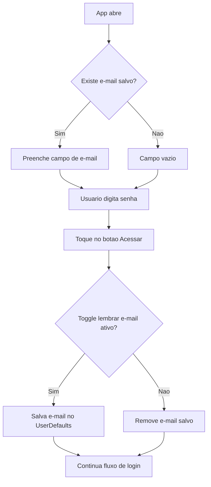
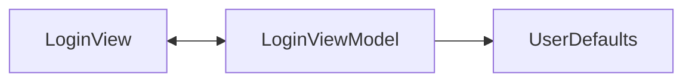

# Guia Temporario: Login SwiftUI + MVVM

> Objetivo do exercicio:
> Criar uma tela com:
> - TextField para e-mail
> - SecureField para senha
> - Toggle para lembrar e-mail
> - Botao para acessar
> - Se Toggle estiver ativo, preencher e-mail automaticamente na proxima abertura

---

## Visao Geral (desenho do fluxo)



---

## Arquitetura MVVM (simples)



- `View` mostra os campos e captura interacao.
- `ViewModel` guarda estado e regra de salvar/remover e-mail.
- `UserDefaults` persiste dado local (equivalente a SharedPreferences no Android/Java).

---

## Codigo Completo (didatico)

### 1) LoginViewModel.swift

```swift
import Foundation
import Combine

final class LoginViewModel: ObservableObject {
    @Published var email: String = ""
    @Published var password: String = ""
    @Published var rememberEmail: Bool = false

    private let savedEmailKey = "saved_email"

    init() {
        loadSavedEmail()
    }

    private func loadSavedEmail() {
        let saved = UserDefaults.standard.string(forKey: savedEmailKey) ?? ""

        if !saved.isEmpty {
            email = saved
            rememberEmail = true
        }
    }

    func login() {
        persistEmailPreference()

        // Aqui entraria chamada de API/autenticacao
        print("Login com e-mail: \(email)")
    }

    private func persistEmailPreference() {
        if rememberEmail {
            UserDefaults.standard.set(email, forKey: savedEmailKey)
        } else {
            UserDefaults.standard.removeObject(forKey: savedEmailKey)
        }
    }
}
```

### 2) LoginView.swift

```swift
import SwiftUI

struct LoginView: View {
    @StateObject private var viewModel = LoginViewModel()

    var body: some View {
        VStack(spacing: 16) {
            Text("Login")
                .font(.largeTitle)
                .bold()

            TextField("E-mail", text: $viewModel.email)
                .textInputAutocapitalization(.never)
                .autocorrectionDisabled(true)
                .keyboardType(.emailAddress)
                .padding()
                .background(Color(.secondarySystemBackground))
                .cornerRadius(10)

            SecureField("Senha", text: $viewModel.password)
                .padding()
                .background(Color(.secondarySystemBackground))
                .cornerRadius(10)

            Toggle("Lembrar e-mail", isOn: $viewModel.rememberEmail)

            Button("Acessar o sistema") {
                viewModel.login()
            }
            .frame(maxWidth: .infinity)
            .padding()
            .background(canAccess ? Color.blue : Color.gray)
            .foregroundColor(.white)
            .cornerRadius(10)
            .disabled(!canAccess)

            Spacer()
        }
        .padding()
    }

    private var canAccess: Bool {
        !viewModel.email.isEmpty && !viewModel.password.isEmpty
    }
}

#Preview {
    LoginView()
}
```

---

## Explicacao Rapida por Partes

### `@Published`
Quando `email`, `password` ou `rememberEmail` mudam, a `View` atualiza automaticamente.

### `init() + loadSavedEmail()`
Assim que o ViewModel nasce, ele tenta recuperar e-mail salvo.

### `UserDefaults`
Guarda dados pequenos no aparelho. Aqui usamos para guardar apenas o e-mail.

### `persistEmailPreference()`
- Toggle ligado: salva e-mail.
- Toggle desligado: remove e-mail salvo.

---

## Comparacao com Java (para fixar)

- SwiftUI `@Published` + `ObservableObject` -> parecido com estado observavel (`LiveData`/`StateFlow`).
- Swift `UserDefaults` -> equivalente ao `SharedPreferences`.
- SwiftUI `@StateObject` -> ciclo de vida do ViewModel dentro da tela.

---

## Checklist do Exercicio

- [x] TextField para e-mail
- [x] SecureField para senha
- [x] Toggle lembrar e-mail
- [x] Botao para acessar
- [x] Preenchimento automatico do e-mail quando salvo

---

## Proximo Passo (opcional)

1. Validar formato de e-mail.
2. Mostrar erro visual se senha estiver vazia.
3. Navegar para Home apos login bem-sucedido.
